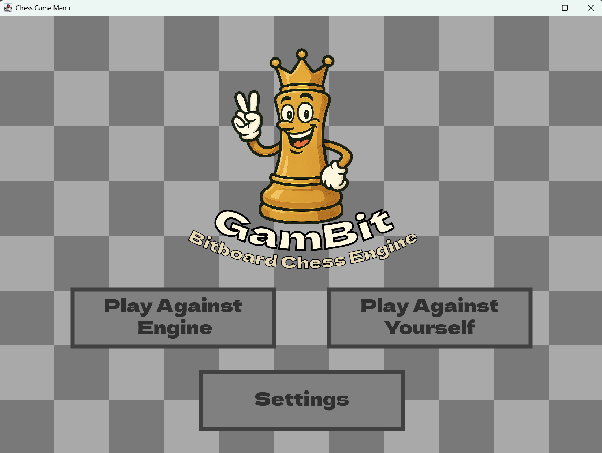

# ♟️ GamBit Chess Engine V1.1 ♟️


GamBit is a custom-built chess engine implemented in **Java**, utilizing bitboard-based move generation, **negamax search with alpha-beta pruning**, and **quiescence search** to evaluate complex positions. Inspired by the techniques used in engines like Stockfish and Crafty, GamBit is designed to be compact, efficient, and educational.

---

## 🚀 Features

### ✅ Bitboard Representation
GamBit uses **18 Java `long` values** to efficiently track board state using bitwise operations:

- **White/Black Piece Types**: Tracks individual piece types (e.g., `whitePawns`, `blackKnights`).
- **White/Black Pieces**: Tracks all pieces of each side to calculate blockers and threats.
- **En Passant**: Identifies pawns vulnerable to en passant.
- **HasNotMoved**: Flags for unmoved pieces (castling and 2-step pawn logic).
- **CheckingPieces**: Tracks which pieces are checking the king.

### ✅ Negamax with Alpha-Beta Pruning
Uses recursive **negamax** with **alpha-beta pruning** to simulate potential moves and cut unpromising branches—greatly improving speed and depth.

### ✅ Quiescence Search
Avoids evaluation in “noisy” tactical positions by extending the search only with captures and checks—reducing blunders in volatile states.

### ✅ MVV_LVA Move Ordering
Prioritizes moves that capture high-value pieces with low-value attackers, improving pruning performance.

### ✅ ZOBRIST HASHING
Hashes unique positions using a series of random Longs and the XOR operation for fast and efficienct position hashing

---

## 🧠 Engine Benchmarking

### ✅ Best Depth
- Effective play up to **depth 5** before timing becomes significant.

### ✅ NPS Benchmark Results

<pre>
========== Benchmark Result ==========
Depth: 5 | Runs: 10
Total Nodes: 977710
Total Time: 6.38 sec
TT Hit Rate: 1.95%
TT Cutoff Rate: 0.95%
Average NPS: 153235 nodes/sec
========== System Info ==========
OS Name: Windows 11
OS Version: 10.0
Architecture: amd64
Available Cores: 16
System Load: 0.00%
Process Load: 7.23%
Java Version: 22.0.2
JVM: OpenJDK 64-Bit Server VM
</pre>

### ✅ Engine Evaluation

- Evaluated by **Stockfish 16** at an estimated **2000–2250 ELO**
- Defeated **Komodo engines** rated 2000–2200 on Chess.com

---

## 🧪 How to Run

### 🔹 Play Against GamBit

To run the application from the packaged JAR file, use the following command in your terminal or command prompt:

```bash
java -jar dist/GamBit.jar
```

### 🔹 Run Benchmark Test
- Open `src/model/Main.java`
- Run as Java application to start NPS test

### 🔹 Cloning Project

To clone the project and make changes, follow these steps:

1. Use the following command in your terminal or command prompt:

```bash
git clone https://github.com/ColinGale/GamBit-Chess-Engine.git
```

2. Import project into IDE of choice

3. Ensure that res folder is included as a source folder in build path

4. Run the program from `src/view/Main.java` or `src/model/Main.java`

5. (IF CLASS NOT FOUND ERROR) Clean project files to ensure IDE generates own class files

---

## 🖥️ UI Preview



---

## 🔧 Configuration

| Parameter     | Description                                             |
|---------------|---------------------------------------------------------|
| `depth`       | Search depth for minimax search                         |
| `MATE_SCORE`  | Evaluation constant for checkmate detection             |

---

## 🛠️ Version Control

- ♟️v1.0 - Initial Version
- ♟️v1.1 - Added Zobrist Hashing / Transposition Tables for Faster Lookup (140,000 NPS -> 150,000 NPS)

---

## 📁 Project Structure

<pre>
/src 
  ├── /model
  │     ├── GamBit.java ← Core engine logic 
  │     ├── Bitboard.java ← Bitboard representation & move generation 
  │     └── MoveSet.java ← Move data container 
  └── /view 
        ├── BoardPanel.java ← GUI rendering & game loop 
        └── Main.java ← GUI entry point
/res 
  |── /magic_data ← Magic bitboard lookup tables 
  ├── /menu ← GUI resource images 
  └── /piece ← Chess piece images 
</pre>

---

## 🙏 Acknowledgments

- Inspired by **Stockfish**, **Crafty**, and the broader chess programming community
- Special thanks to [chessprogramming.org](https://www.chessprogramming.org) for bitboard concepts and search optimization techniques

---

## 📜 License

This project is open for **educational and personal use**.

To redistribute or contribute, consider adding a license such as [MIT](https://opensource.org/licenses/MIT) or [Apache 2.0](https://www.apache.org/licenses/LICENSE-2.0).

---

**Enjoy mastering the board with GamBit!**
